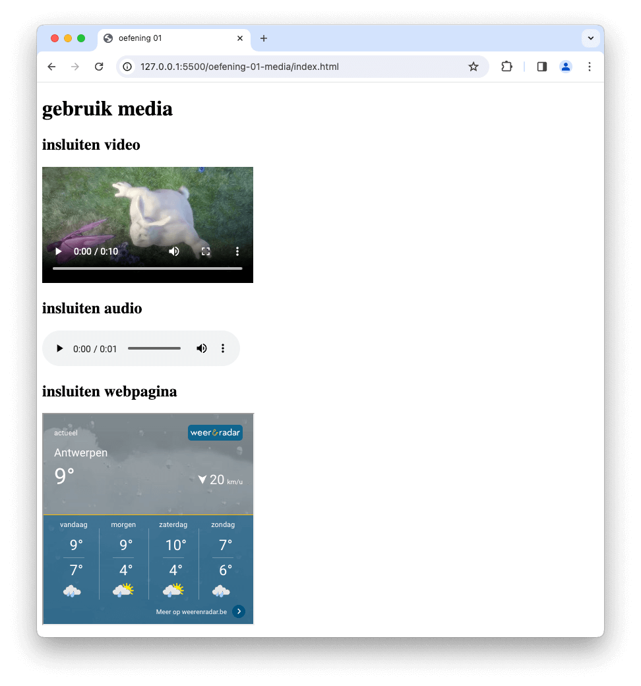

# 💻 03. HTML & Bootstrap > oefening 01

## 🛠️ opdrachten

### `index.html` maken

- [ ] Maak een nieuw bestand genaamd `index.html` aan in deze map.
- [ ] Open het bestand.

### voorbeeld namaken

- [ ] Maak het volgende voorbeeld na met behulp van HTML. Gebruik hiervoor de elementen uit de vorige labo's, en zoek op hoe je gebruik maakt van de elementen `video`, `audio` en `iframe`.
- [ ] Gebruik voor video volgende link:

  - [<source src="https://www.w3schools.com/html/mov_bbb.mp4" type="video/mp4">] `<source src="https://www.w3schools.com/html/mov_bbb.mp4" type="video/mp4">`

- [ ] Gebruik voor audio volgende links:

  - [<source src="">`
https://www.w3schools.com/html/horse.mp3" type="audio/ogg">] `<source src="https://www.w3schools.com/html/horse.mp3" type="audio/mp3
- [ ] Gebruik volgend iframe (anders dan op voorbeeld):
  - [] `<iframe src="https://api.wo-cloud.com/content/widget/?geoObjectKey=12697687&language=nl&region=BE&timeFormat=HH:mm&windUnit=kmh&systemOfMeasurement=imperial&temperatureUnit=celsius" title="Antwerpen meteo" width="318" height="318"></iframe>`

## 💡 vragen

- Waarvoor dient het `controls`-attribute?
- Waarvoor staat de `source`-element?
- Wanneer gebruik je meerdere `source`-elementen?
