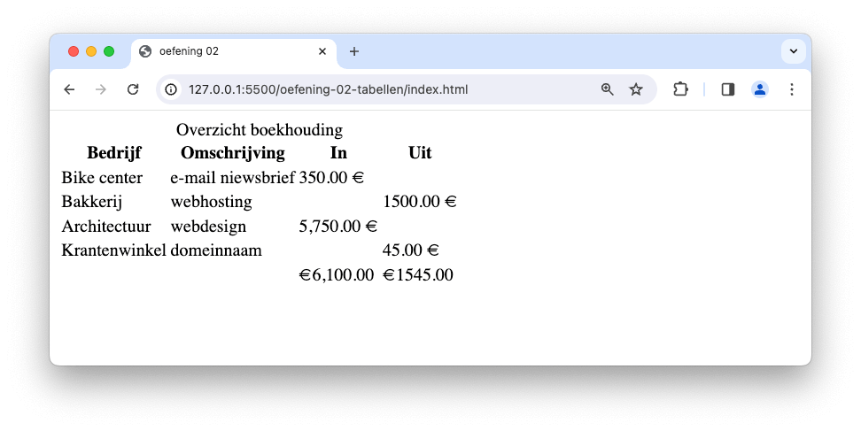

# 💻 03. HTML & Bootstrap > oefening 02

## 🛠️ opdrachten

### `index.html` maken

- [ ] Maak een nieuw bestand genaamd `index.html` aan in deze map.
- [ ] Open het bestand.
- [ ] Voeg de [Bootstrap meta-informatie](/README.md) toe aan je `head`-element om Bootstrap te kunnen gebruiken.

### voorbeeld namaken

- [ ] Maak een [semantische tabel](https://apwt.gitbook.io/g_webtechnologie/html/html-tabellen). Maak gebruik van de elementen `caption`, `table`, `thead`, `tbody` en `tfoot`. In die elementen maak je gebruik van de elementen `th` (met `scope="col"`), `tr` en `td`.
- [ ] Gebruik de [correcte HTML-entiteiten](https://apwt.gitbook.io/g_webtechnologie/html/html-speciale-karakters) voor de euro-tekens en lege cellen.

## 💡 vragen

- Wat is het verschil tussen de elementen `th` en `td`?
