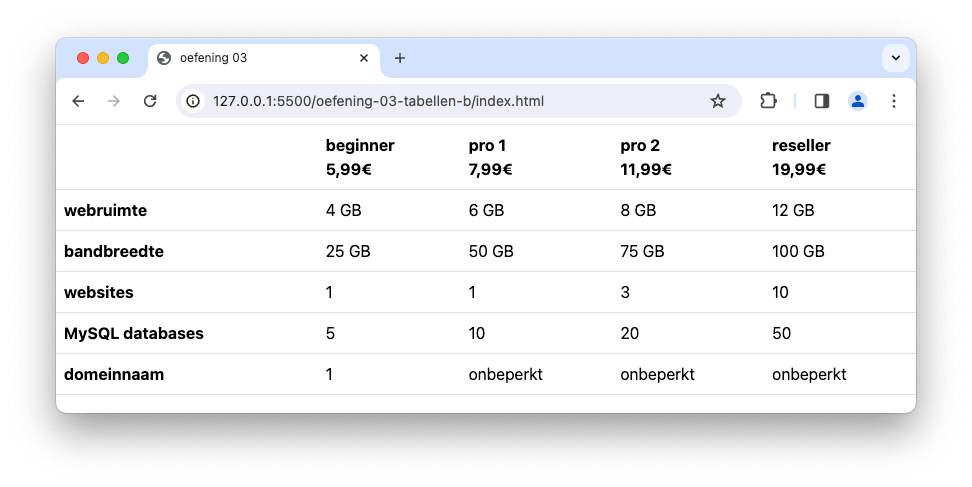

# 💻 03. HTML & Bootstrap > oefening 03

## 🛠️ opdrachten

### `index.html` maken

- [ ] Maak een nieuw bestand genaamd `index.html` aan in deze map.
- [ ] Open het bestand.
- [ ] Voeg de [Bootstrap meta-informatie](/README.md) toe aan je `head`-element om Bootstrap te kunnen gebruiken.

### voorbeeld namaken

- [ ] Maak een [semantische tabel](https://apwt.gitbook.io/g_webtechnologie/html/html-tabellen). Maak gebruik van de elementen `thead` (met `scope="col"` voor de `th` -en  `br` om de tekst op een volgende lijn te zetten-), `tbody` (met `scope="row"` voor de `th`) en `tfoot`
- [ ] Voeg de klasse `table` toe aan het `table` element.

