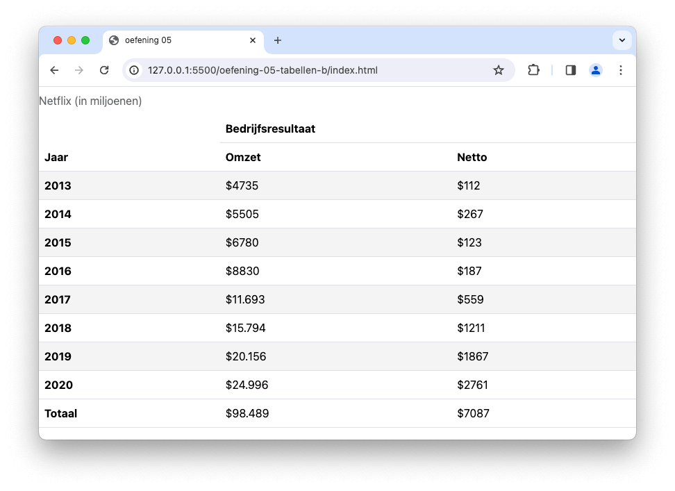

# 💻 03. HTML & Bootstrap > oefening 05

## 🛠️ opdrachten

### `index.html` maken

- [ ] Maak een nieuw bestand genaamd `index.html` aan in deze map.
- [ ] Open het bestand.
- [ ] Voeg de [Bootstrap meta-informatie](/README.md) toe aan je `head`-element om Bootstrap te kunnen gebruiken.

### voorbeeld namaken

- [ ] Maak het voorbeeld na met behulp van een [semantische tabel](https://apwt.gitbook.io/g_webtechnologie/html/html-tabellen).
- [ ] In het `thead`-element worden [cellen samengevoegd](https://apwt.gitbook.io/g_webtechnologie/html/html-tabellen). Gebruik hiervoor de attributes `rowspan` en `colspan`.
- [ ] **tip:** (Bootstrap) Deze tabel is _gestreept_ en de titel (caption) staat _bovenaan_.

