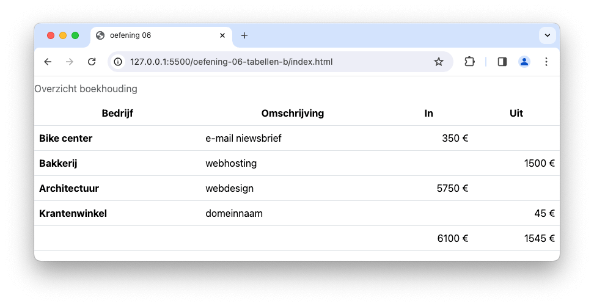

# 💻 03. HTML & Bootstrap > oefening 06

## 🛠️ opdrachten

### `index.html` maken

- [ ] Maak een nieuw bestand genaamd `index.html` aan in deze map.
- [ ] Open het bestand.
- [ ] Voeg de [Bootstrap meta-informatie](/README.md) toe aan je `head`-element om bootstrap te kunnen gebruiken.

### voorbeeld namaken

- [ ] Zet [oefening 2](/oefening02/index.html) om naar HTML5 en Bootstrap.
  - zet de titel van de tabel bovenaan
  - maak bij `<th>` gebruik van `scope="col"` en `scope="row"`
  - lege td's worden gevuld met `&nbsp;`
  - euro-tekens worden als HTML-entiteit geschreven
- [ ] **tip:** (Bootstrap) de tekst in `thead` staat gecentreerd
- [ ] **tip:** (Bootstrap) de kolommen met woorden in `tbody` staan links uitgelijnd
- [ ] **tip:** (Bootstrap) de kolommen met cijfers in `tbody` staan rechts uitgelijnd

